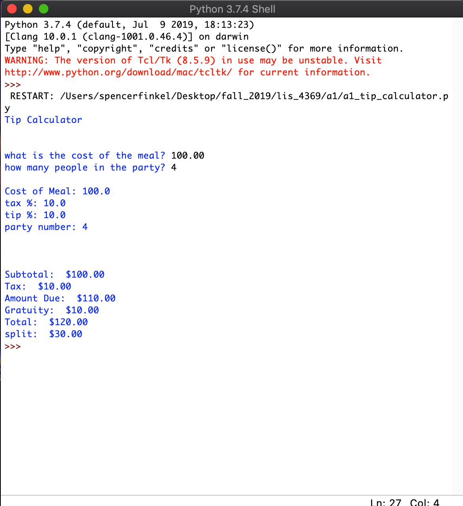
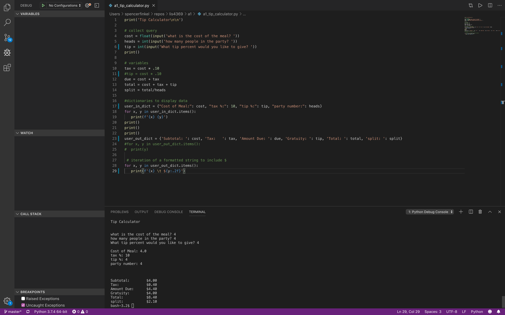

---
output:
  word_document: default
  html_document: default
---

# LIS4369 - Extensible Enterprise Solutions 

## Spencer Finkel

### **Assignment 1 Requirements:** 
1. Distributed Version Control with Git and Bitbucket
2. Development Installations 
3. Questions
4. Bitbucket repo links
    1. Tip calculator
    2. bitbucketstationlocations

#### README.md file should include the following items:
* Screenshots of a1_tip_calculator in IDLE and VS Code
* git commands with short descriptions

> This is a blockquote.
> 
> This is the second paragraph in the blockquote.
>
> #### Git commands w/short descriptions:

1. git init - creates a new local directory
2. git status - lists the status of staged changes
3. git add - adds a file to staging 
4. git commit - saves changes to local repository
5. git push - pushes changes to remote repository
6. git pull - copies changes to local repository
7. git checkout - switches branch

#### Assignment Screenshots:

#### Bitbucket Repository Links:

*Bitbucket Tutorial - Station Locations:*
[Bitbucket Station Locations Link](https://bitbucket.org/stolidMiscellanea/bitbucketstationlocation/src/master/ "Bitbucket Station Locations")

*LIS4369 Repository:*
[Repository Link](https://bitbucket.org/stolidMiscellanea/lis4369/src/master/)

