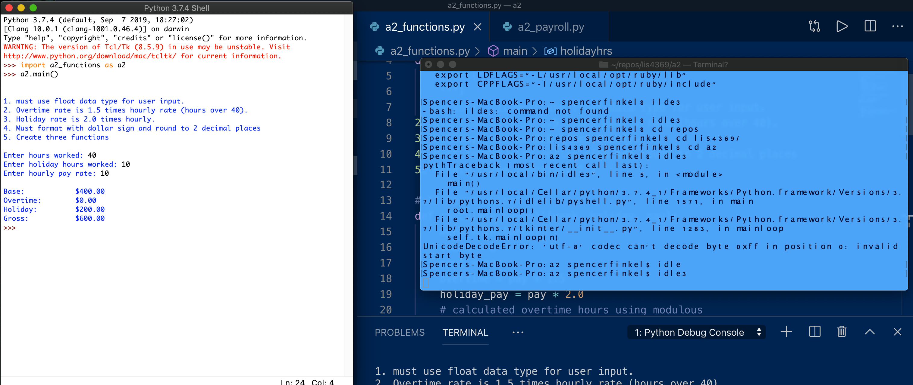
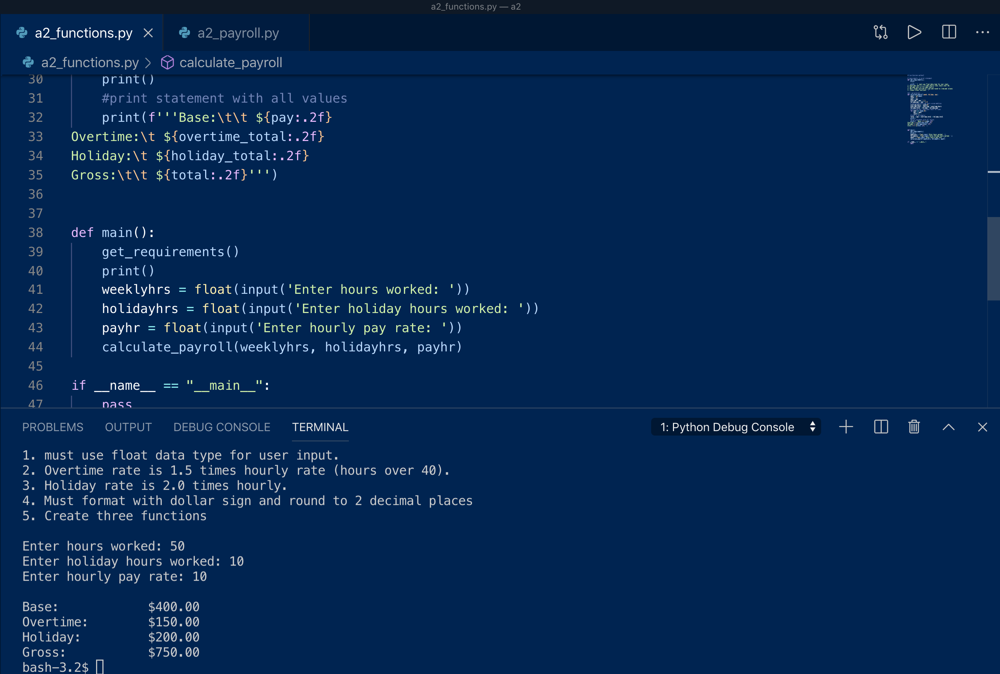

---
output:
  word_document: default
  html_document: default
---

# LIS4369 - Extensible Enterprise Solutions 

## Spencer Finkel

### **Assignment 2 Requirements:** 
1. Create a payroll calculator to compute a weekly salary
2. Questions
3. Program Requirements
    1. must use float data type for user input
    2. Overtime rate is 1.5 times hourly rate      (hours over 40)
    3. Holiday rate is 2.0 times hourly
    4. Must format with dollar sign and round      to 2 decimal places
    5. Create three functions

### **Information**
1. Use a seperate python file to create functions
2. Put all made functions inside a main() function
3. use an if __name__ = '__main__' statement to test if main() is the main module 

#### Assignment Screenshots:

#### Bitbucket Repository Link:

*LIS4369 Repository:*
[Repository Link](https://bitbucket.org/stolidMiscellanea/lis4369/src/master/)