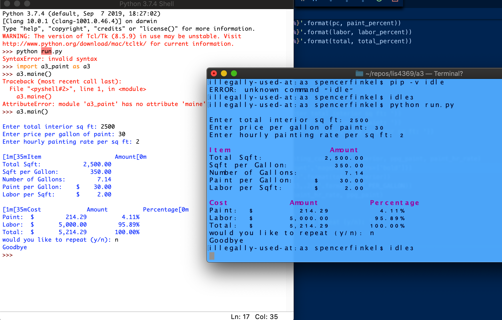
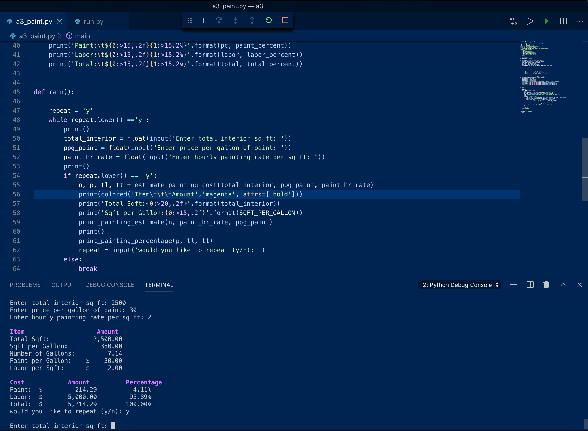

---
output:
  word_document: default
  html_document: default
---

# LIS4369 - Extensible Enterprise Solutions 

## Spencer Finkel

### **Assignment 3 Requirements:** 
1. Create Painting Estimator
2. Create a seperate module with all functions
3. Use an iterator
4. Questions

#### README.md file should include the following items:
* Screenshots of a3_paint_estimator in IDLE and VS Code

#### Assignment Screenshots:

#### Bitbucket Repository Links:

*LIS4369 Repository:*
[Repository Link](https://bitbucket.org/stolidMiscellanea/lis4369/src/master/)