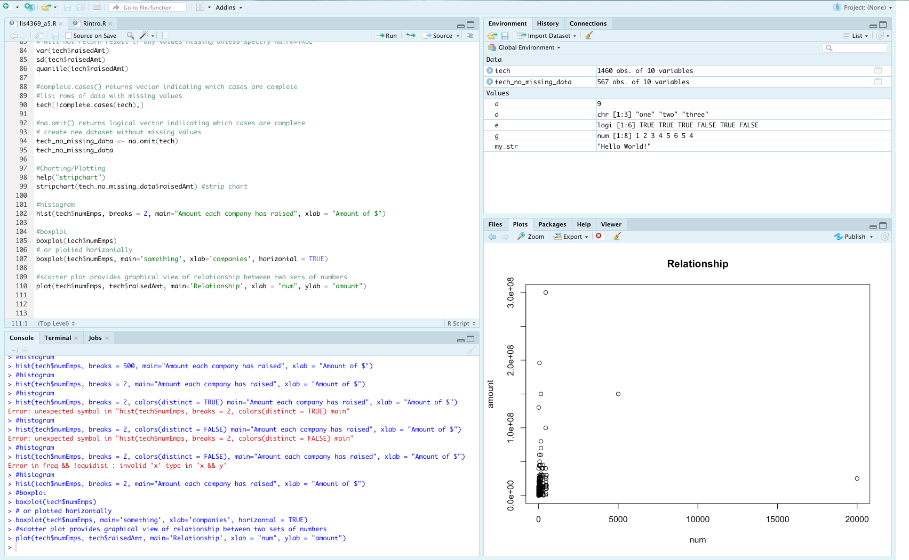
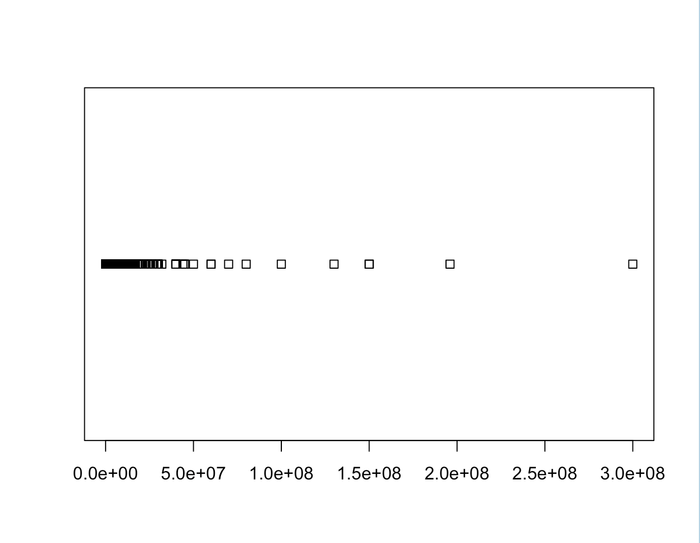

---
output:
  word_document: default
  html_document: default
---

# LIS4369 - Extensible Enterprise Solutions 

## Spencer Finkel

### **Assignment 5 Requirements:** 
1. Complete the Rforbeginners tutorial
    1. Note all functions/commands from tutorial
    2. Take screenshots of Rstudio and accompanying charts
2. Complete a5.R 
    1. Screenshots of environement
    2. Screenshots of accompanying charts
3. Questions
4. Bitbucket repo links
   

#### README.md file should include the following items:
* Introduction to R photos/code
* a5 photos/code

#### Assignment Screenshots:

#### Bitbucket Repository Links:

*LIS4369 Repository:*
[Repository Link](https://bitbucket.org/stolidMiscellanea/lis4369/src/master/)