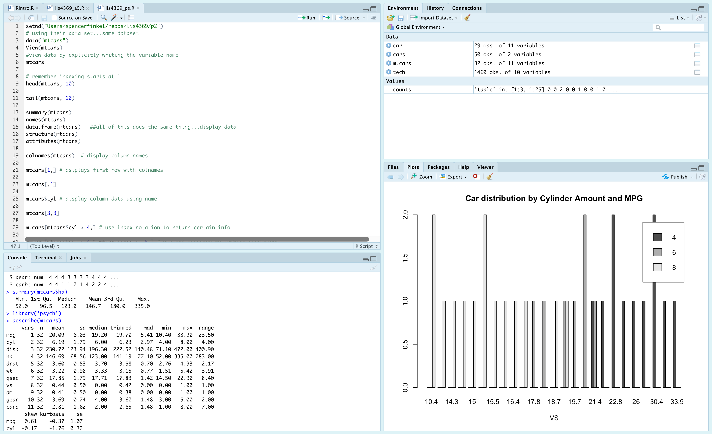
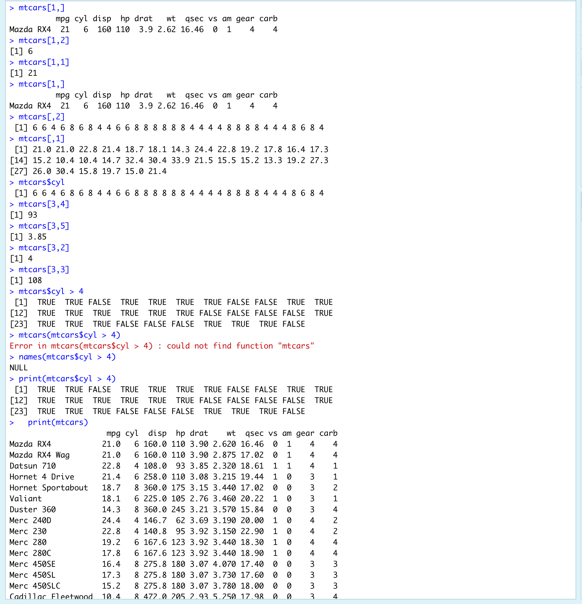
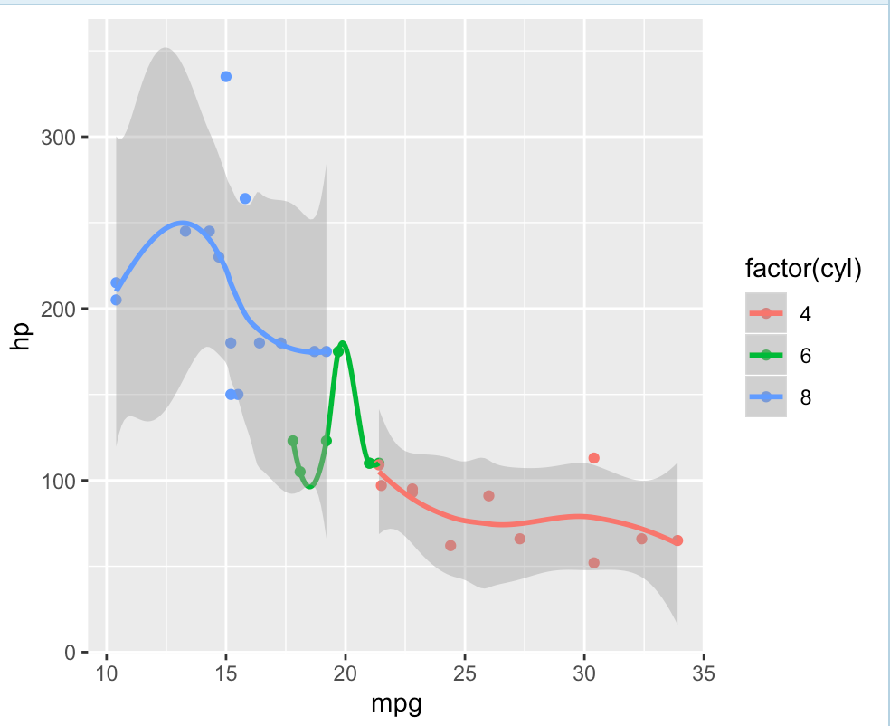
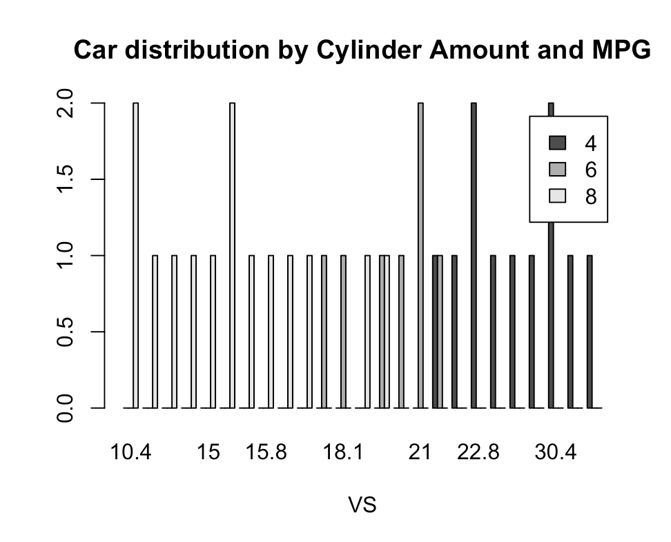

---
output:
  word_document: default
  html_document: default
---

# LIS4369 - Extensible Enterprise Solutions 

## Spencer Finkel

### **Project 2 Requirements:** 
1. Backward Engineer the lis4369_p2 requirements.txt file
    1. Perform R commands on mtcars dataset
    2. Put mtcars into dataframe for data extraction
    2. Take screenshots of Rstudio and accompanying charts
3. Questions
4. Bitbucket repo link
   

#### README.md file should include the following items:
* RStudio data/code and plot screenshots

#### Assignment Screenshots:

#### Bitbucket Repository Links:

*LIS4369 Repository:*
[Repository Link](https://bitbucket.org/stolidMiscellanea/lis4369/src/master/)